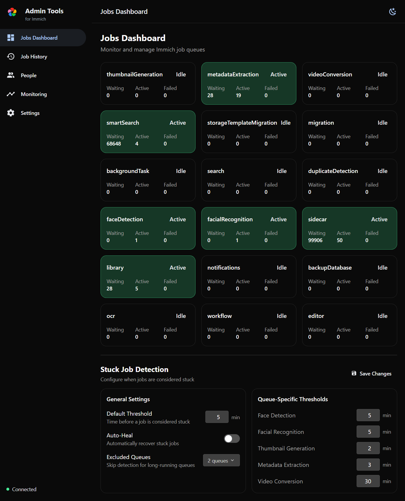
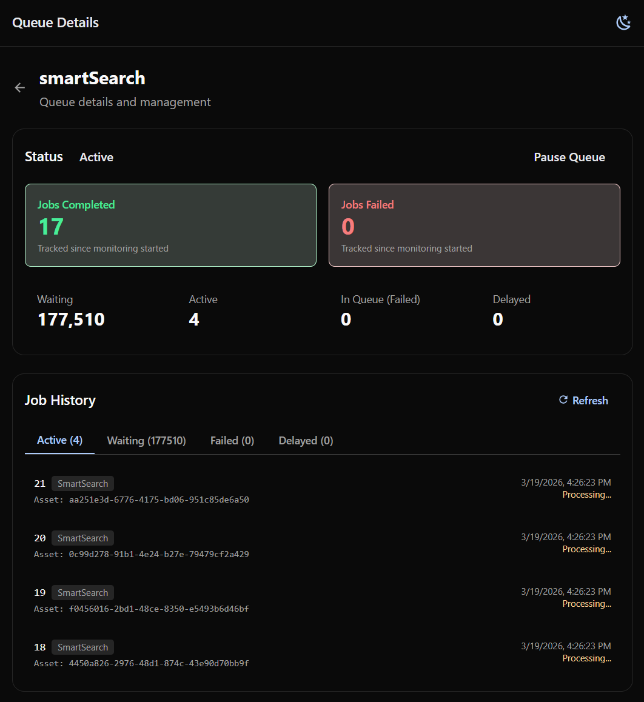
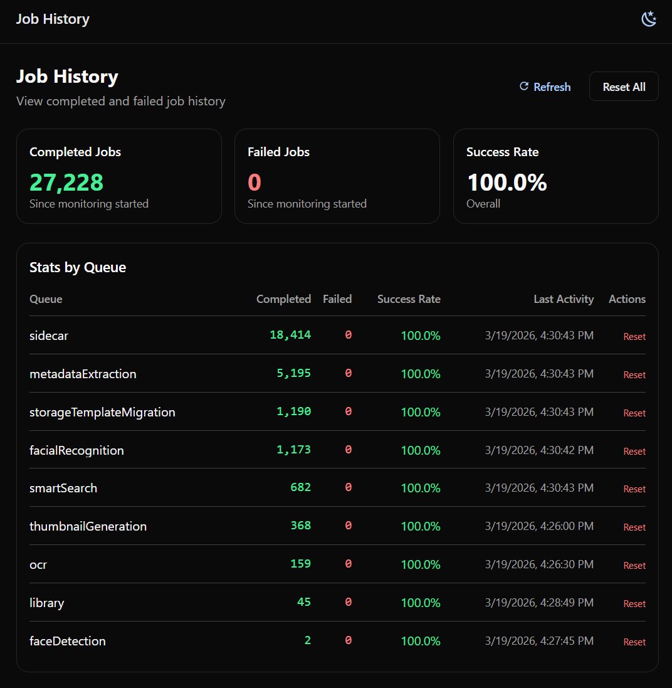
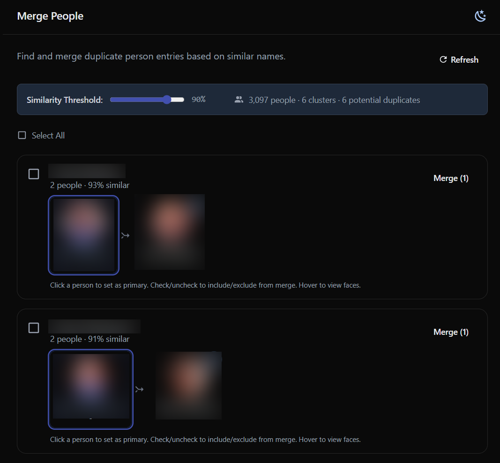
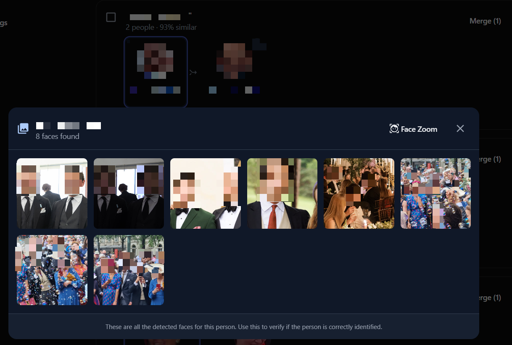
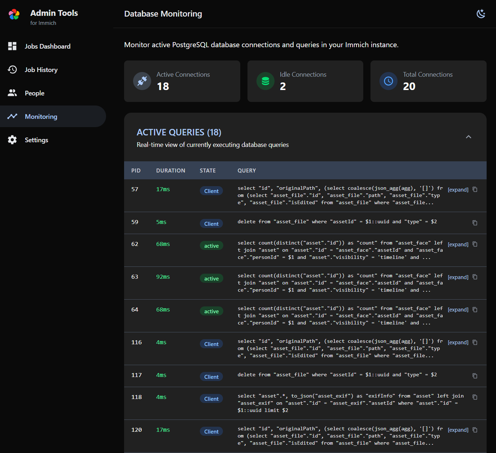

# Immich Admin Tools

<p align="center">
  <a href="LICENSE"></a>
  <a href="https://github.com/immich-app/immich"></a>
</p>

<p align="center">
  <strong>Enhanced queue management, people deduplication, and face-group cleanup for Immich</strong>
</p>

<p align="center">
  <em>More transparency. More control. Less stuck jobs. Cleaner people groups.</em>
</p>

---

## The Problem

If you run [Immich](https://immich.app/) with a large photo library (100k+ photos), you've likely experienced:

- **Stuck jobs** - Jobs show as "active" for hours without completing
- **Silent failures** - No indication of *why* processing stopped
- **Manual recovery** - Having to run Redis CLI commands to clear zombie jobs
- **Poor visibility** - Can't see which files are causing problems
- **Duplicate people** - Similar person entries that need manual merging

This happens because BullMQ (Immich's job queue) marks jobs as "active" when a worker picks them up, but if that worker hangs (corrupted file, memory issue, unexpected restart), the job stays "active" forever—eventually blocking the entire queue.

## The Solution

**Immich Admin Tools** is a companion dashboard that runs alongside your Immich instance, providing:

It started as a queue operations tool, but it also includes a dedicated **People** workflow to clean up duplicate/fragmented face groups with visual review before merging.

### Queue Management
| Feature | Description |
|---------|-------------|
| **Real-time Dashboard** | Live queue status with job counts and processing state |
| **Stuck Job Detection** | Automatically detect jobs running longer than expected |
| **One-Click Recovery** | Clear stuck jobs without touching Redis CLI |
| **Asset Identification** | See exactly which files are causing problems |
| **Queue Control** | Pause/resume individual queues |
| **Job Browser** | Browse active, waiting, failed, and delayed jobs with pagination |
| **Auto-Heal Mode** | Optionally auto-clear stuck jobs on a schedule |

### People & Face Grouping
| Feature | Description |
|---------|-------------|
| **Duplicate Detection** | Find likely duplicate people using fuzzy name matching |
| **Similarity Clustering** | Tune threshold (50-100%) to broaden or narrow grouping |
| **Cluster Review** | Inspect each suggested group and pick the primary person |
| **Face Inspection** | Open all detected faces for a person (zoomed face/full image views) before merging |
| **Selective Merge Control** | Include/exclude individual people inside a cluster |
| **Bulk Merge** | Merge many reviewed clusters at once with progress tracking |

### Database Monitoring
| Feature | Description |
|---------|-------------|
| **Live Query Monitoring** | See active PostgreSQL queries in real-time |
| **Connection Stats** | Monitor active and idle database connections |
| **Query History** | Persistent log of finished queries with search and filtering |
| **Lock Detection** | Identify wait events and lock contention |

### Statistics & History
| Feature | Description |
|---------|-------------|
| **Job Statistics** | Cumulative completed/failed counts per queue |
| **Success Rates** | Color-coded success rate tracking |
| **Historical View** | Track job completion patterns over time |

## UI Gallery

Get a quick feel for the app before you install it:

| Jobs Dashboard | Queue Details | Job History |
|---|---|---|
| [](assets/jobs-dashboard.png) | [](assets/queue-details.png) | [](assets/job-history.png) |

| People Merge | Face Review | Database Query Monitoring |
|---|---|---|
| [](assets/merge-people.png) | [](assets/merge-people-face-review-ui.png) | [](assets/database-query-monitoring.png) |

## Quick Start

```yaml
# Add to your docker-compose.yml
services:
  immich-admin-tools:
    image: ghcr.io/guwidoe/immich-admintools:latest
    container_name: immich_admin_tools
    environment:
      - IMMICH_API_URL=http://immich_server:2283
      - IMMICH_API_KEY=${IMMICH_API_KEY}
      - REDIS_URL=redis://immich_redis:6379
      # Optional: Database monitoring (requires direct PostgreSQL access)
      - DB_HOST=immich_postgres
      - DB_PORT=5432
      - DB_USERNAME=postgres
      - DB_PASSWORD=${DB_PASSWORD}
      - DB_DATABASE_NAME=immich
    ports:
      - "2285:3000"
    restart: unless-stopped
    # If running alongside the Immich docker-compose stack, uncomment:
    # networks:
    #   - immich_default
```

Then visit `http://localhost:2285`

### Building from Source

If you prefer to build the image yourself:

```bash
git clone https://github.com/guwidoe/immich-admintools.git
cd immich-admintools
docker build -f docker/Dockerfile -t immich-admintools .
```

Then use `image: immich-admintools` instead of the GHCR reference above.

## Configuration

### Required Environment Variables

| Variable | Description |
|----------|-------------|
| `IMMICH_API_URL` | URL to your Immich server (e.g., `http://immich_server:2283`) |
| `IMMICH_API_KEY` | API key generated in Immich (Profile > API Keys) |
| `REDIS_URL` | Redis connection URL (e.g., `redis://immich_redis:6379`) |

### Optional Environment Variables

| Variable | Default | Description |
|----------|---------|-------------|
| `PORT` | `3000` | Server port |
| `DB_HOST` | - | PostgreSQL host (enables database monitoring) |
| `DB_PORT` | `5432` | PostgreSQL port |
| `DB_USERNAME` | - | PostgreSQL username |
| `DB_PASSWORD` | - | PostgreSQL password |
| `DB_DATABASE_NAME` | `immich` | PostgreSQL database name |
| `AUTO_HEAL_ENABLED` | `false` | Automatically clear stuck jobs |
| `AUTO_HEAL_INTERVAL` | `60` | Auto-heal check interval (seconds) |
| `EXCLUDED_QUEUES` | `backup-database` | Queues excluded from stuck detection (comma-separated) |
| `THRESHOLD_DEFAULT` | `300` | Default stuck job threshold (seconds) |
| `THRESHOLD_FACE_DETECTION` | `300` | Face detection queue threshold |
| `THRESHOLD_FACIAL_RECOGNITION` | `300` | Facial recognition queue threshold |
| `THRESHOLD_THUMBNAIL` | `120` | Thumbnail generation threshold |
| `THRESHOLD_METADATA` | `180` | Metadata extraction threshold |
| `THRESHOLD_VIDEO` | `1800` | Video conversion threshold |

## Requirements

- Immich v2.4.0+ (uses the `/queues` API)
- Docker
- An Immich API key (generate in Immich: Profile > API Keys)
- Network access to Immich's Redis instance
- (Optional) Network access to PostgreSQL for database monitoring

## Tech Stack

Built to feel native to Immich:

- **Frontend**: SvelteKit 5 + Svelte 5 + [@immich/ui](https://ui.immich.app)
- **Backend**: NestJS 11 (TypeScript)
- **API**: [@immich/sdk](https://www.npmjs.com/package/@immich/sdk)
- **Styling**: Tailwind CSS 4

## Development

```bash
# Install dependencies
pnpm install

# Start development servers
pnpm dev

# Build for production
pnpm build
```

## Contributing

Contributions are welcome! If you find a bug or have a feature request:

1. **Report issues** on [GitHub Issues](https://github.com/guwidoe/immich-admintools/issues)
2. **Submit PRs** - Fork the repo, create a feature branch, and open a pull request

Please ensure your code follows the existing style and includes appropriate tests.

## Why a Separate Tool?

This is **not** intended to become an official Immich feature. Instead, it serves as:

1. **A reference implementation** - Shows how job management problems can be solved
2. **Inspiration for Immich devs** - Ideas they can study when tackling these issues natively
3. **Immediate relief** - Users get a solution *now* instead of waiting for core fixes
4. **Proof of concept** - Demonstrates the value of proper stuck job detection

If Immich eventually implements native stalled job detection (via BullMQ's built-in features), this tool becomes less necessary—and that's a win for everyone.

## Related Resources

- [Immich](https://immich.app/) - The photo management solution
- [GitHub Issue #22180](https://github.com/immich-app/immich/issues/22180) - Job timeout feature request
- [Immich Power Tools](https://github.com/varun-raj/immich-power-tools) - Bulk photo management (different scope)

## License

This project is licensed under the AGPL-3.0 License - see the [LICENSE](LICENSE) file for details.

This is the same license as Immich itself, ensuring compatibility.

---

<p align="center">
  Made with care by the Immich community
</p>
